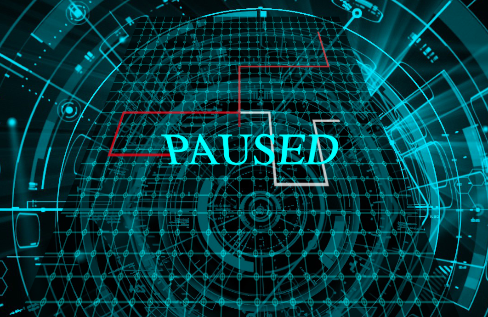
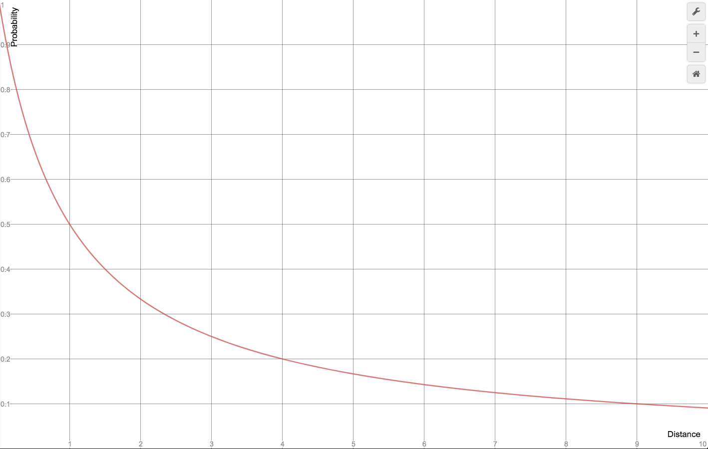

# TronLightCycles   

A Javascript web-game recreating the classic _light cycle_ battle from the movie Tron. The goal of the game is to force your opponent to collide with trail created by your _light cycle_ as it traverses the arena.  

Target Example:  


My Version:  


##  Features To Note  
The background playing surface is drawn using HTML Canvas. It is a static image that is drawn once during the initialization of the game class that manages all of the game logic.  
It is drawn like so: 

```javascript
  initBoard() {
    this.ctx.fillStyle = 'rgba(0, 0, 0, 0.8)';
    this.ctx.fillRect(0, 0, 600, 600);

    this.drawGrid(this.ctx, this.canvas.height, this.canvas.width, 25);

    this.startState();
  }
```

The Player and Computer Bikes, however, are represented using SVG Polylines because the path created (represented in a 'points' array) can be easily manipulated. 

```javascript
  <polyline id="player" style="fill:none;stroke:#ffffff;stroke-width:5"/>
```

```javascript
  const point = svg.createSVGPoint();
  point.x = this.x;
  point.y = this.y;
  
  ...
   
  this.poly.points.appendItem(point);
```

There are 3 AI opponents that can somewhat intelligently maneuver the playing surface. Each AI opponent updates its position and direction based on a callback function that is set to fire every 10 milliseconds. At each iteration of the 'increment' callback function each AI opponent must decide whether to move left, right or continue going straight.  

The current implementation has each AI picking between turning left and turning right with equal probability, but the probability that the bike makes a turn rather than continuing to go straight scales with the calculated distance to the next obstacle on its current path (either another _light cycle_ trail or the boundary wall).  

The function that dictates this behavior looks like this:  


And the formula is implemented in my game logic like this:  
```javascript
    let dist = this.calcDist();
    let prob_thresh = 1 / (dist + 1);
    let prob = Math.random();

    if (prob < prob_thresh / 2) {
      this.vel = LEFT_TURNS[String(this.vel)];
    } else if (prob < prob_thresh) {
      this.vel = RIGHT_TURNS[String(this.vel)];
    }
```

## MVP List  
1. Functional movement and "trail" drawing
2. Styling of the arena, light cycles and trails
3. Game mechanics with win and loss conditions
4. AI opponents that actively attempt to encircle the human player in their trails
5. (bonus) Pseudo-3D graphics   
